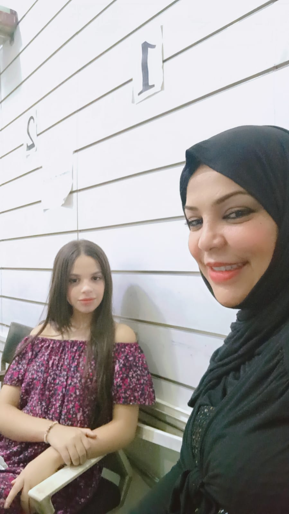

# Amira Nawali (Amoura) - Personal Portfolio

A premium, interactive personal portfolio website for Amira Nawali featuring an ultra-catchy feminine Apple-like UI/UX design, smooth transitions, and multilanguage support (French, English, Arabic).



## Features

- **Premium Apple-like Feminine Design** - Modern, sleek interface with frosted glassmorphism, soft pink/rose gold aesthetics, and carefully crafted animations.
- **Multilingual Support** - Full support for French, English, and Arabic, including RTL layout.
- **Innovative Language Selector** - Custom-designed intuitive language toggle with smooth animations.
- **Responsive Layout** - Fully responsive design that works on all device sizes.
- **Scroll-Triggered Animations** - Content reveals as user scrolls through the page with elegant image overlays.
- **Next-Level UX** - Advanced back-to-top button, custom loading spinners, and pixel glitch fonts.
- **Performance Optimized** - Fast loading times and smooth scrolling experience.

## Technologies

- HTML5, CSS3, JavaScript (ES6+)
- GSAP for advanced animations
- Lenis for smooth scrolling
- Custom-built language switching system
- CSS Variables for theme flexibility

## Sections

- À Propos (About)
- Passion (Skills)
- Moments (Projects)
- Expérience (Experience)
- Inspiration (Education)
- Contact
- Vision
- Avenir (Future)

## Development Team

### Original Concept & Content
- **Amira Nawali (Amoura)**

### Enhancement and UI/UX Design
- **Marwen Rabai** - Premium UI/UX Design & Frontend Development
  - [Portfolio](http://marwenrabai.com)
  - Email: rbnarwenrba@gmail.com
  - GitHub: [@Marwenrb](https://github.com/Marwenrb)

## Setup

1. Clone the repository
   ```bash
   git clone https://github.com/Marwenrb/Amira-Portfolio.git
   ```
2. Start a local server (e.g. `npx serve` or `python -m http.server`) to avoid CORS issues with ES6 modules.
3. Open `http://localhost:8000` (or the port specified by your server) in your browser.

## License

All rights reserved. This project and its contents are not open for redistribution or commercial use without permission.

---

Made with ❤ by Marwen
